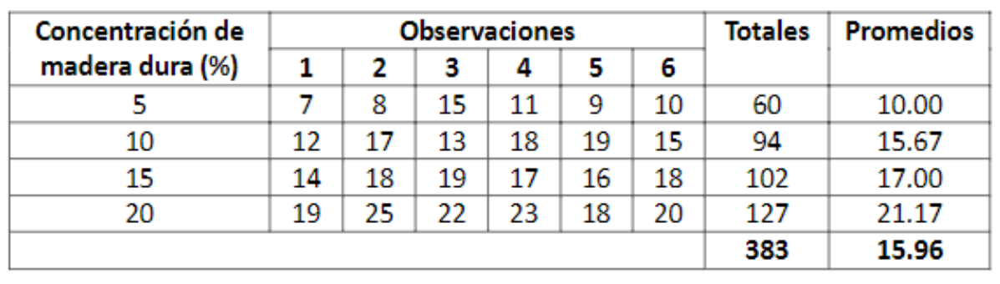

```{r setup, include=FALSE}
knitr::opts_chunk$set(echo = TRUE)

library(dplyr)
library(ggplot2)
library(moments)
library(e1071)
library(lmtest)
```

# Actividad 2.2 ANOVA

Un fabricante de papel para hacer bolsas comestibles se encuentra interesado en mejorar la resistencia a la tensión del producto. El departamento de ingeniería del producto piensa que la resistencia a la tensión es una función de la concentración de madera dura en la pulpa y que el rango de las concentraciones de madera dura de interés práctico está entre 5% y 20%.

El equipo de ingenieros responsables del estudio decide investigar cuatro niveles de concentración de madera dura 5%, 10%, 15% y 20%. Deciden hacer seis ejemplares de prueba con cada nivel de concentración utilizando una planta piloto. Las 24 muestras se prueban en orden aleatorio con una máquina de laboratorio para probar resistencia. A continuación, se muestran los datos de este experimento.



¿Hay alguna diferencia en la resistencia del papel causada por la concentración de madera dura?

## 0. Importación de los Datos

```{r}
data_path = r"{..\data\resistencia.csv}"
df <- as.data.frame(read.csv(data_path))
df$Concentracion <- as.factor(df$Concentracion)
df
```

## 1. Análisis Exploratorio de Datos

```{r}
summary_df <- df %>%
  group_by(Concentracion) %>%
  summarize(
    Min = min(Resistencia, na.rm = TRUE),
    Q1 = quantile(Resistencia, 0.25),
    Q2 = quantile(Resistencia, 0.50),
    Mean = mean(Resistencia, na.rm = TRUE),
    Q3 = quantile(Resistencia, 0.75),
    Max = max(Resistencia, na.rm = TRUE),
    SD = sd(Resistencia, na.rm = TRUE),
    Skew = skewness(Resistencia, na.rm = TRUE),
    Kurtosis = kurtosis(Resistencia, na.rm = TRUE),
    count = n()
  )

summary_df
```

```{r}
ggplot(df, aes(x = as.factor(Concentracion), y = Resistencia)) +
  geom_boxplot(fill = "lightblue") +
  labs(
    title = "Boxplot of Resistencia by Concentracion",
    x = "Concentracion",
    y = "Resistencia"
  ) +
  theme_minimal()
```

Al agrupar los datos según sus respectivas concentraciones, se puede observar una tendencia ascendiente en la media de las muestras a lo largo del aumento en la concentración. Si bien las medias fueran muy similares entre concentraciones, indicaría que la resistencia no varía según la concentración. Como se observa justamente lo contrario, incluso la posibilidad de una relacion lineal entre concentración y resistencia, es razonable argumentar que la resistencia a la tensión es una función de la concentración de madera dura en la pulpa.

## 2. Hipótesis Estadística

Siendo $i,j \in [5,10,15,20]$ referencias a las concentraciones de cada grupo, las hipótesis planteadas serían las siguientes.

$$
H_0:= \forall (i,j),\mu_i = \mu_j
$$

$$
H_A:= \exists (i,j),\mu_i \neq \mu_j
$$

En términos directos, la hipótesis nula implica que las medias entre grupos permanece constante y puede decirse que son las mismas. En el caso contrario, no se tiene suficiente evidencia estadística para afirmar que todas las medias son iguales. La hipótesis nula en este contexto negaría que la resistencia es una función de la concentración, mientras la hipótesis alterna indica que no se tiene suficiente evidencia estadística para afirmar la falta de una relación entre variables.

## 3. ANOVA: Suma de Cuadrados Medios

```{r}
overall_mean = mean(df$Resistencia)
group_means = summarize(group_by(df, Concentracion), Mean = mean(Resistencia), Count = n())

# Errors
SSE = sum((df$Resistencia - group_means$Mean[match(df$Concentracion, group_means$Concentracion)])**2)

# Groups

SSR = sum((group_means$Mean - overall_mean)**2 * group_means$Count)

# Total
SST = SSR + SSE

k = length(group_means$Concentracion)
n = length(df$Resistencia)

df_groups = k - 1
df_error = n - k
df_total = n - 1

MSE = SSE / df_error
MSR = SSR / df_groups

f_stat = MSR / MSE

print(paste("SSE: ", SSE))
print(paste("SSR: ", SSR))
print(paste("SST: ", SST))

print(paste("df Grupos: ", df_groups))
print(paste("df Error: ", df_error))
print(paste("df Total: ", df_total))

# print(k)
# print(n)

print(paste("MSE: ", MSE))
print(paste("MSR: ", MSR))

print(paste("F: ", f_stat))
```

## 4. ANOVA en R

```{r}
modelo = aov(Resistencia ~ Concentracion, df)
summary(modelo)
```

Tanto el cálculo manual como el resultado proporcionado por el método aov() de R, se tiene un estadístico de F de 19.61 que corresponde a un valor de p igual a $3.6 \times 10^{-6}$ , indicando que se tiene evidencia estadística suficiente para afirmar que al menos un par de medias muestrales no son equivalentes.

## 5. Diferencias por Pares

```{r}
TukeyHSD(modelo)
plot(TukeyHSD(modelo, conf.level = 0.95))

```

## 6. Validación de Supuestos

### 6.1 Normalidad de los Errores

Shapiro-Wilk normality test

-   $H_0:=$ La distribución de los errores es normal

-   $H_A:=$ La distribución de los errores no es normal

```{r}
residuos = modelo$residuals

shapiro.test(residuos)
qqnorm(residuos)
qqline(residuos)
hist(residuos,freq=FALSE)
lines(density(residuos),col="red")
curve(dnorm(x,mean=mean(residuos), sd=sd(residuos)), from=min(residuos), to=max(residuos), add=TRUE, col="blue",lwd=2)
```

### 6.2 Homocedasticidad

Bartlett Test of Homogeneity of Variances

-   $H_0:=$ Los datos tienen homocedasticidad.

-   $H_A:=$ Los datos no tienen homocedasticidad.

```{r}
bartlett.test(df$Resistencia, df$Concentracion)
plot(modelo$fitted.values, modelo$residuals)
abline(h=0, col = "red", lwd = 2)
```

### 6.3 Independencia

Durbin Watson

-   $H_0:=$ No existe autocorrelación en los datos

-   $H_A:=$ Existe autocorrelacion en los datos.

```{r}
dwtest(modelo)
plot(modelo$residuals)
abline(h=0, col = "red", lwd = 2)
```

Ya que en ninguna de las pruebas se tiene un valor de p menor a 0.05, no se pueden rechazar las hipótesis nulas con las que verificamos que los supuestos se cumplen.

## 7. Intervalos de Confianza por Nivel

```{r}
t_test_result <- df %>%
  group_by(Concentracion) %>%
  summarize(
    Conf_Lower = t.test(Resistencia)$conf.int[1],
    Mean = mean(Resistencia),
    Conf_Upper = t.test(Resistencia)$conf.int[2]
  )

t_test_result
```

## 8. Conclusión

El análisis de varianza ANOVA demostró que la concentración de madera dura en la pulpa afecta significativamente la resistencia a la tensión del papel, con un valor F de 19.61 y un valor p de 3.6×10⁻⁶. El test post-hoc de Tukey reveló que las concentraciones más altas, especialmente el 20%, presentan una resistencia significativamente mayor comparado con las concentraciones más bajas. Las pruebas de validación indicaron que los supuestos del ANOVA se cumplieron adecuadamente. Estos resultados sugieren que aumentar la concentración de madera dura puede mejorar la resistencia del papel, lo que es relevante para optimizar la calidad del producto.
